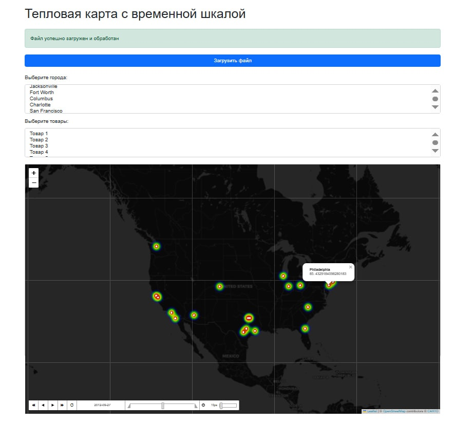

# Проект «Прогнозирование количества товаров в зависимости от погодных условий»

**Авторы:**  
- Вячин Александр (Тимлид)
  - Предобработка данных.
  - Выбор модели.
  - Веб-сервер.
  - Инференс модели.
- Булхуков Абя
  - Подбор гиперпараметров модели.
  - Обучение модели.
- Гутуев Никита
  - Анализ данных.
  - Визуализация данных.
  - Определение "важности" признаков.
- Плотников Иван
  - Описание проекта.
  - Подготовка презентации. 

## Цель проекта

Необходимо разработать модель, которая позволит оценить влияние погодных условий на продажи товаров в определенных локациях. В то же время модель должна показывать хорошую точность по метрикам MAE/R2 и быть интерпретируемой для вычисления коэффициентов.

### Основные аспекты проекта

- **Связь станций с городами:** Найдены пары "станция-город" исходя из предобработки данных.
- **EDA:** Проведен развернутый анализ данных относительно weather.csv и выявлены непобходимые для модели признаки.
- **Выбор и обучение модели:** Выбрана модель PoissonGAM, которая хорошо описывает нелинейные связи в признаках и имеет интерпретируемые коэффициенты.
- **Система коэффициентов:** Получена система коэффициентов для каждой пары "город-товар" с возмиожностью предсказания без обученной модели в памяти из файла gam_data.pkl с параметрами terms.
- **Реализация веб-сервера:** Реализован удобный интерфейс на основе веб-сервера Flask с картой мира folium для наглядности прогнозирования.

## Структура репозитория

- [**data/**](./data/):
  - Архив всех данных, использованных в проекте.
  - Ноутбук "data_cleaning.ipynb" с сопоставлением пар город-станция и предобработкой данных.
  - Ноутбук "EDA.ipynb" с развернутым анализом данных.

- [**model/**](./analysis/):
  - Пикл-файл "gam_data.pkl" с системой коэффициентов и параметрами "термов" модели для каждой пары "город-товар"
  - Ноутбук "getting_coefs.ipynb" с обучением модели, составлением пикл-файла "gam_data.pkl". 

- [**web/**](./web/):
  - Директория "data" с необходимыми для веб-сервера данными (в том числе для тестирования).
  - Директория "templates" с html-файлами фронта веб-сервера.
  - Скрипт "main.py" с классовым описанием веб-сервера.

## Технологии и инструменты

- **Языки и фреймворки:**  
  - Python 3.10+  
  - Flask (серверная часть)
  - folium (карта мира с поддержкой координат)
  - pandas/numpy (извлечение, анализ и предобработка данных)
  - sklearn/pygam (обучение модели)
  - dill (формирование .pkl файла)
  
- **Модель:**  
  - Poisson Generalized Additive Models (Статистическая модель библиотеки pygam с возможностью описания нелинейных зависиомстей через интерпретируемые коэффициенты).

- **Аналитика и визуализация:**  
  - Jupyter Notebook для прототипирования, анализа данных и экспериментов.
  - Matplotlib, Seaborn для графического представления информации.

- **Управление проектом:**  
  - GitHub для контроля версий.

## Пройденные этапы

- **EDA:**  
  - Произведена первичная предобработка данных и составлены пары "станция-город" в файле "city_station.csv".
  - Построена матрица корреляции.
  - Большинство признаков имеют симметричное или скошенное распределение.
  - Целевая переменная несбалансирована. 
  - Булевые признаки отдельных кодов признака 'codesum' имеют слабое влияние на целеую переменную.
  - Пропуски в признаках ['sunrise', 'sunset'] заменены средним значением по месяцу.
  - Признаки ['depart', 'snowfall', 'sealevel'] были удалены по причине большого количества пропусков.
  - Часть булевых признаков удалены по причине своей неинформативности.

- **Обучение модели:**  
  - Произведен выбор модели PoissonGAM по причинам:
    -  Положительная область предсказаний.
    -  Описания нелинейных зависимостей.
    -  Вывод коэффициентов для пердсказания без модели в памяти.
    -  Лучшая точность (MAE ~23) на тестовой выборке.
  - Произведен подбор гиперпараметров ['lam', 'n_splines'].
  - Модель обучена на каждой паре "город-товар".
  - Выведены и сохранены коэффициенты и параметры "термов" модели.

- **Веб-сервер:**  
  - Реализована фронт-составляющая веб-сервера:
    - Представлена возможность загрузки файла для предсказания и вывода результата.
    - Представлена возможность выбора филтьтрации по городу или типу товара перед загрузкой файла.
    - Внедрена карта мира с визуализацией heatmap.
    - При нажатии на точку магазина на карте выводится список предсказанных товаров. 
  - Реализована подготовка данных к предсказанию.
  - Реализовано предсказание количества товаров относительно погоды через коэффициенты и параметры "термов" из файла "gam_data.pkl".
  - Реализован расчет heatmap относительно результатов предсказаний.

## Дальнейшее развитие

- Подбор "термов" модели с использованием тензорного терма для описания влияния кодов погоды на числовые признаки для улучшение точности модели.
- Распараллеливание обучения модели на парах "город-товар" для более полного перебора параметров и повышения скорости обучения.
- Реализация предсказаний через коэффициенты без использования параметров "термов" модели для повышения скорости предсказаний.
- Оптимизация работы с файлами веб-сервера для ускоренния получения предсказаний и визуализации.
- Добавление функционала автоматического масштабирования и более явной отрисовки heatmap карты веб-сервера для улучшения наглядности и удобства пользования.

## Установка и использование веб-сервера:

### 1. Клоинрование репозитория
$ git clone https://github.com/bababasbebebe/Weather.git

$ cd Weather/web

### 2. Установление версий библиотек
$ pip install -r requirements.txt

### 3. Запуск веб-сервера
$ python main.py

### 4. Открыть http://127.0.0.1:5000 для использования веб-сервера

## Лицензия

Проект распространяется по лицензии MIT. Подробности в файле `LICENSE`.
