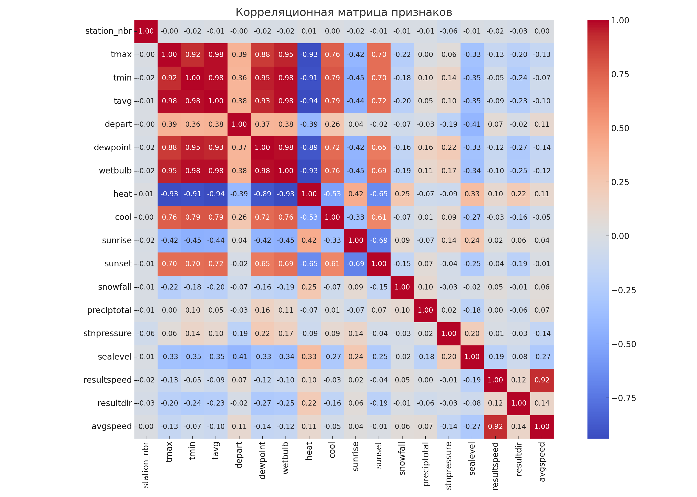

🌦 Weather EDA by Station
=========================

Анализ погодных данных по метеостанциям на основе файла `weather.csv`.

📂 Содержимое проекта
---------------------

* `weather.csv` — исходный датасет  
* `weather_full_eda_script.py` — Python-скрипт для анализа  
* `summary_statistics_new.csv` — сводная статистика по всем данным  
* `station_summary.csv` — средние значения по метеостанциям  
* `tavg_over_time.png` — график средней температуры  
* `precip_total_over_time.png` — график осадков  
* `correlation_matrix.png` — матрица корреляций между числовыми признаками  

---

🧪 Шаги EDA
-----------

1. **Загрузка и приведение данных**
   * Преобразование столбца `date` в `datetime`
   * Обработка значений 'M' и прочих нечисловых — замена на NaN
2. **Сводная статистика (`summary_statistics_new.csv`)**
3. **Агрегация по метеостанциям (`station_summary.csv`)**
4. **Графики:**

📈 **Средняя температура по времени:**


🌧 **Осадки по времени:**


📌 **Матрица корреляций:**


---

📊 Основные выводы
------------------

* Присутствуют пропущенные значения, обозначенные как `'M'` — они обработаны.
* Метеостанции показывают различные погодные условия.
* Корреляционная матрица позволяет определить взаимосвязи между признаками.
* Данные подходят для прогнозных моделей и климатического анализа.

---

🚀 Быстрый запуск
-----------------

```bash
pip install pandas matplotlib seaborn
python weather_full_eda_script.py
```
