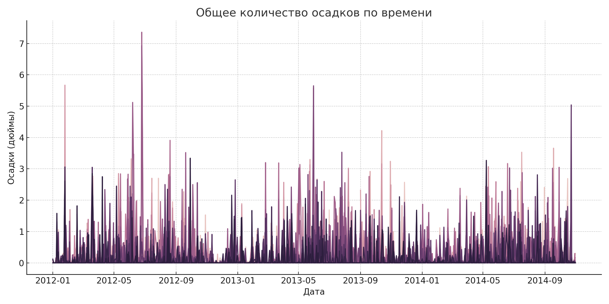

🌦 Weather EDA
=========================

Анализ погодных данных по метеостанциям на основе файла `weather.csv`.

📂 Содержимое проекта
---------------------

* `weather.csv` — исходный датасет  
* `weather_full_eda_script.py` — Python-скрипт для анализа  
* `summary_statistics_new.csv` — сводная статистика по всем данным  
* `station_summary.csv` — средние значения температуры, осадков и других параметров по метеостанциям  
* `tavg_over_time.png` — график изменения средней температуры  
* `precip_total_over_time.png` — график изменения осадков  

---

🧪 Шаги EDA
-----------

1. **Загрузка и приведение данных**
   * Преобразование столбца `date` в `datetime`
   * Обработка значений 'M' и прочих нечисловых — замена на NaN
2. **Сводная статистика (`summary_statistics_new.csv`)**
   * Оценка распределений по всем числовым признакам
3. **Агрегация по метеостанциям (`station_summary.csv`)**
   * Средние значения температуры, осадков, давления и ветра
4. **Графики:**

📈 **Средняя температура по времени:**


🌧 **Осадки по времени:**


---

📊 Основные выводы
------------------

* Присутствуют пропущенные значения, обозначенные как `'M'` — они обработаны.
* Данные охватывают множество метеостанций с разными погодными условиями.
* Наблюдаются сезонные колебания температуры и выпадения осадков.
* Данные подходят для построения моделей прогнозирования или оценки климатических изменений.

---

🚀 Быстрый запуск
-----------------

```bash
pip install pandas matplotlib seaborn
python weather_full_eda_script.py
```
